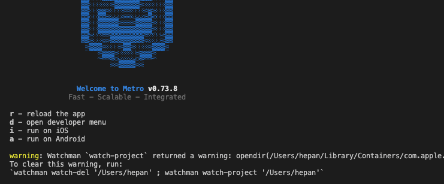

# 这是一个 RN 项目， 按照官方文档创建

- 目的是为了生成一个运行在 Android 设备上的 App

- 这是一个纯粹的 RN 项目，默认支持 Android 与 iOS 构建， 这里仅使用 Android

官方文档：
https://reactnative.dev/docs/environment-setup

---

2023-03-10 初次构建

## 步骤
- 命令行创建项目： npx react-native@latest init RNProjectForAndroid

- 启动 Metro， 在项目所在目录下，执行命令： npx react-native start. 启动成功,控制台输出如图所示信息

    

- 编译构建 App
  - 保留 Metro 所在的终端， 新启一个终端
  - 执行命令 npx react-native run-android
  - 会遇到各种错误，依次解决
  - 公司电脑使用了 Gas Mask， 引起网络不通，可以如下处理 ： 查看电脑的 网络偏好设置——>高级->代理， 关闭网页代理；

if everything is set up correctly, you should see your new app running in your Android emulator（device） shortly.
```
    > Task :app:installDebug
    `Installing APK 'app-debug.apk' on 'Pixel 3 - 12' for :app:debug
    Installed on 1 device.
```

